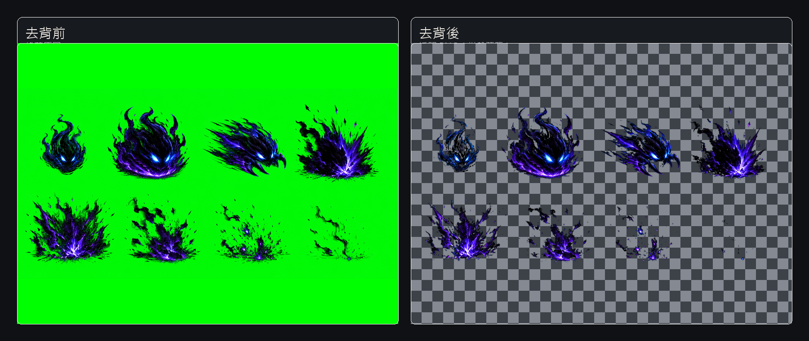

# 遊戲素材去背助手

一個在瀏覽器本機執行的遊戲素材去背工具，主要用來處理 AI 生成素材、特效素材、綠幕素材、黑底光效、白底玻璃與棋盤格背景圖片。

工具不需要上傳圖片到伺服器，所有處理都在使用者自己的瀏覽器中完成。適合用來快速整理遊戲素材、特效圖、技能圖、透明 PNG 素材與批量去背流程。

## Demo 連結

GitHub Pages Demo：

https://zxc02621948-sketch.github.io/game-asset-bg-remover/

如果頁面尚未開啟，請先在 GitHub repository 的 Pages 設定中啟用部署。

### 綠幕特效去背前後對比

右側為透明 PNG 放在棋盤格預覽背景上，棋盤格不會輸出到圖片中。

## 主要功能

- 支援拖放多張圖片批量處理
- 支援 PNG / JPG / WebP
- 第一版預設一次最多處理 10 張圖片
- 支援黑底、白底、綠幕、棋盤格與自訂背景色
- 可依圖片類型選擇處理方式：
  - 混合素材
  - 煙霧 / 光效
  - 實體物件
- 提供常用預設：
  - 黑底物件
  - 煙霧光效
  - 玻璃透鏡
  - 綠幕素材
- 可即時預覽：
  - 去背結果
  - 黑白範圍
  - 原圖
- 可切換預覽底色：
  - 棋盤
  - 遊戲深色
  - 黑色
  - 白色
- 支援常用微調：
  - 清除強度
  - 保留細節
  - 邊緣柔和
  - 智能修邊
  - 修邊強度
- 支援點選補修：
  - 點一下清殘留
  - 標記玻璃 / 煙霧區
  - 標記不要動的區域
- 支援只找相連區域或找整張相近顏色
- 支援半透明區自動清小黑點
- 支援綠幕去背與去綠 / 青色邊
- 可匯出目前圖片為透明 PNG
- 可批量匯出 ZIP
- 顯示批次效能風險提示：
  - 張數
  - 最大解析度
  - 總像素
  - 預估記憶體

## 使用方式

1. 打開 `index.html`
2. 匯入或拖放圖片
3. 選擇背景是哪一種
4. 選擇圖片類型
5. 選擇常用預設，或直接微調清除強度與保留細節
6. 如果局部有殘留，使用點選補修工具
7. 確認結果後匯出 PNG 或 ZIP

## 適合用途

- AI 生成遊戲素材去背
- 黑底技能特效整理
- 綠幕特效素材去背
- 玻璃、透鏡、煙霧、光效半透明處理
- RPG / ARPG / 卡牌遊戲技能素材整理
- 批量整理透明 PNG 素材
- Game jam 素材快速處理

## 免責說明

本工具是遊戲素材前處理與去背輔助工具，不保證能在所有圖片上產生完美結果。

去背品質會受到原圖條件影響，例如：

- 背景與主體顏色太接近
- 原圖已有壓縮雜訊
- 透明材質與背景混在一起
- 特效邊緣過於細碎
- 光效、煙霧、玻璃與實體物件混在同一張圖中

本工具所有圖片處理都在使用者本機瀏覽器中進行，不會主動上傳圖片。但使用者仍應自行確認素材授權、圖片來源、商業使用權與最終輸出結果。

若用於正式遊戲、商業作品或素材販售，請自行檢查輸出圖片是否符合品質與授權需求。

## 目前限制

- 第一版偏向瀏覽器本地處理，不適合一次匯入大量超高解析圖片
- 對複雜半透明材質仍可能需要手動點選補修
- 棋盤格背景若已經被烘進圖片中，工具只能估算，無法百分之百還原原始透明度
- 綠幕素材如果本體也有大量綠 / 青色，可能需要降低去綠邊或加上保護區
- 工具目前不使用 AI 模型，主要依靠影像運算、顏色判斷與使用者點選輔助

## 未來規劃

- 增加筆刷式保護 / 清除工具
- 增加選區預覽顏色，讓補修範圍更清楚
- 增加一鍵清除小色邊功能
- 增加黑白雙底 Alpha 還原模式
- 增加更好的玻璃 / 煙霧材質處理
- 增加批量設定套用與單張覆蓋設定
- 增加匯出 WebP
- 增加輸出尺寸與命名規則設定
- 增加低記憶體批量處理模式
- 增加操作教學與範例素材

## 技術說明

- 純前端工具
- 不需要後端
- 使用 HTML / CSS / JavaScript
- 使用 Canvas 進行影像處理
- 使用瀏覽器本地 API 進行圖片解碼與匯出
- ZIP 匯出由前端直接產生

## 授權

程式碼授權可依 repository 設定調整。若尚未決定，建議使用 MIT License。
